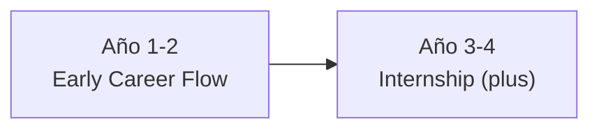
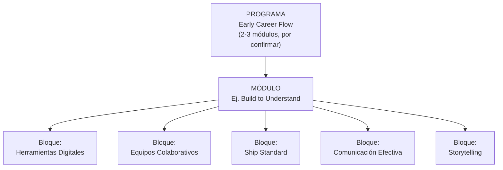

# EARLY CAREER FLOW
### *Semillero de Talento* — Marco General

> **Documento conceptual** 

---

## 1. Origen del nombre

| Concepto | Significado |
|---|---|
| **Early** | La formación inicia en una etapa temprana de la trayectoria del estudiante. |
| **Flow** | Progresión ordenada y secuencial — en referencia directa a la metodología **Git Flow** — que estructura el avance del alumno a lo largo de sus dos años de formación en el trabajo colaborativo. |

**Pilares del programa**

| Elemento | Rol dentro del programa |
|---|---|
| Trabajo colaborativo y habilidades blandas (comunicación, retroalimentación, trabajo en equipo) | **Propósito central** de la formación |
| Tecnología (p. ej. Git) | **Medio** para practicar el trabajo colaborativo — no el fin |
| Habilidades técnicas | Se adquieren **de forma autodidacta**, como soporte de las habilidades blandas |

**Alcance**

- En sentido estricto, *Early Career Flow* corresponde a los **Años 1 y 2**.
- Como un plus adicional, el programa abre la puerta a una etapa de **Internship**, orientada a la vinculación con la industria mediante servicio social, prácticas profesionales u otras modalidades.
- Cada módulo se documenta y se nombra de manera independiente.

---

## 2. Estructura del programa

| Etapa | Años | Enfoque | Estado |
|---|---|---|---|
| **Early Career Flow** | 1–2 | Trabajo colaborativo y habilidades blandas (comunicación, retroalimentación, trabajo en equipo), usando la tecnología como medio, no como fin. Lo técnico se aprende de forma autodidacta. | Año 1: módulo detallado en documento aparte ("Build to Understand")|
| **Internship (plus)** | 3–4 | Integración al departamento de Vinculación mediante servicio social, prácticas profesionales u otras modalidades. | Es un plus del programa, sujeto a selección; no garantizado para todos los participantes. Por definir. |

> **Nota:** el ingreso al programa no garantiza el paso a la etapa de Internship; dicho tránsito está sujeto a un proceso de selección.

---

## 3. Documentación por etapa

Este documento cubre solo el **marco conceptual** de Early Career Flow. El detalle de cada módulo o semestre —objetivos, créditos, calendario, reglas— se documenta por separado, conforme se va definiendo.

### 3.1 Jerarquía del programa

| Nivel | Descripción |
|---|---|
| **Programa** | Early Career Flow — formado por 2 o 3 módulos en total (aún por confirmar el número exacto). |
| **Módulo** | Una unidad completa dentro del programa. Ejemplo: **Build to Understand**. |
| **Bloques** | Las partes que conforman un módulo. Dentro de Build to Understand: Herramientas Digitales, Equipos Colaborativos, Ship Standard, Comunicación Efectiva, Storytelling, etc. |

### 3.2 Módulos del programa

| Módulo | Documentación |
|---|---|
| **Año 1: Build to Understand** | Documento detallado disponible ("Módulo — Build to Understand"). **Énfasis:** trabajo colaborativo, comunicación y pitch, apoyados en tecnología (Git, IA agéntica) como medio. |
| **Año 2: Build to Ship** | Por definir. **Énfasis:** validar la viabilidad del proyecto, respondiendo a la pregunta *"¿es una necesidad real?"*. |

---

## Colaboradores

| Rol | Nombre |
|---|---|
| Autor | David Misael Alcocer Castilla |
| Autor | Edgar Cambranes Martínez |
| Autor | Isaac Alejandro Ortiz Zaldivar |