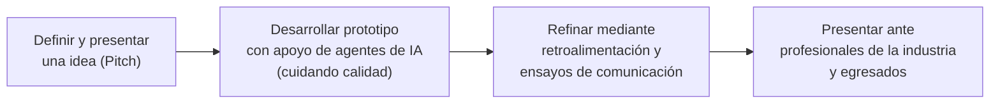
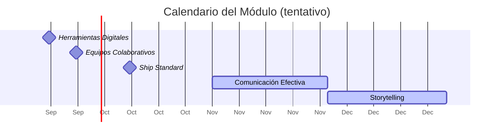

# MÓDULO — SEMESTRE 1
### *Build to Understand*
**Etapa de Formación · Early Career Flow — Formación Integral**

> Documento de trabajo para revisión académica.

---

## 1. Objetivo del módulo

El módulo formaliza una propuesta orientada al desarrollo de proyectos mediante **control de versiones profesional** y el uso de **inteligencia artificial agéntica**, dentro del marco de Formación Integral de Early Career Flow.

Se conforma mediante trabajo en equipos basado en proyectos y comunicación oral, evaluando:

| Dimensión | Qué se evalúa |
|---|---|
| **Conceptualización** | Capacidad del alumno para conceptualizar una solución |
| **Construcción técnica** | Capacidad de construirla con herramientas modernas |
| **Comunicación** | Capacidad de presentarla ante un público evaluador |

---

## 2. Créditos correspondientes

| Concepto | Valor |
|---|---|
| **Créditos curriculares** | 48 horas = **3 créditos** |

---

## 3. Fundamentos de Formación Integral

El diseño del módulo se alinea con un modelo de aprendizaje basado en proyectos (**Project-Based Learning**) dentro del marco de Formación Integral.

El módulo evalúa así **tres dimensiones complementarias**: conceptualización, construcción técnica de calidad y comunicación persuasiva de la idea.

---

## 4. Estructura del módulo

| Bloques | Herramienta / Método | Horas | Modalidad | Entregable clave |
|---|---|---|---|---|
| **1. Herramientas Digitales para Trabajo Remoto** | Git & GitHub Desktop | 8h | 4h presencial / 4h no presencial | Tareas dejadas en formato Markdown de los instructores |
| **2. Equipos Colaborativos** | Git & Terminal | 8h | 4h presencial / 4h no presencial | Video explicativo del proyecto |
| **3. Ship Standard** | Agentic Flow | 8h | En línea / trabajo independiente | Prototipo funcional con atributos de calidad documentados (no maqueta) |
| **4. Comunicación Efectiva** | Pitch and Iteración | 8h | Híbrida / 2–3 checkpoints (feedback) | 2–3 ensayos de pitch y retroalimentación |
| **5. Storytelling** | Deploy Me | 16h | Trabajo independiente / Pitch + Demo | Presentación final ante jurado de la industria y egresados |

**Total: 48 horas**

---

## 5. Calendario del módulo

*Fechas confirmadas hasta el momento:*

| Fase | Bloque | Fecha |
|---|---|---|
| **1** | Herramientas Digitales | 19 de septiembre de 2026 |
| **2** | Equipos Colaborativos | 26 de septiembre de 2026 |
| **3** | Ship Standard | 10 de octubre de 2026 |
| **4** | Comunicación Efectiva | Noviembre 2026 — fecha exacta por definir (2–3 ensayos de pitch) |
| **5** | Storytelling | Diciembre 2026 — TBD |

---

## 6. Contenido por bloque

| Bloque | Enfoque |
|---|---|
| **6.1 Herramientas Digitales para Trabajo Remoto** *("Git & GitHub Desktop")* | Introduce al alumno al trabajo colaborativo mediante control de versiones a través de una interfaz gráfica, priorizando la comprensión del flujo antes que la línea de comandos. |
| **6.2 Equipos Colaborativos** *("Git & Terminal")* | Profundiza la colaboración distribuida entre equipos vía remota, con el uso de Git desde la terminal como herramienta, culminando en un video explicativo del proyecto. |
| **6.3 Ship Standard** *("Agentic Flow")* | Redefine el enfoque original del módulo: ya no se trata únicamente de delegar tareas a agentes de IA, sino de identificar y aplicar los atributos de calidad necesarios para producir un artefacto sólido —un prototipo funcional, no una maqueta—. Corresponde a lo que tradicionalmente se conocía como gestión de configuración. |
| **6.4 Comunicación Efectiva** *("Pitch and Iteration")* | Consiste en 2 a 3 ensayos de pitch durante los cuales el alumno recibe retroalimentación e itera tanto su discurso como su prototipo, en preparación para la presentación final. |
| **6.5 Storytelling** *("Deploy Me")* | Cierra el módulo con la presentación final del proyecto ante profesionales de la industria y egresados, con énfasis en la narrativa que da contexto y valor al artefacto construido. |

---

## 7. Reglas y lineamientos del curso

### 7.1 Política de créditos

El reconocimiento de créditos se basa en que el alumno debe completar satisfactoriamente **todos los bloques del módulo**, incluyendo los ensayos de Comunicación Efectiva, y presentarse en Storytelling, para obtener los 3 créditos curriculares y el reconocimiento correspondiente.

---

## Créditos

| Rol | Nombre |
|---|---|
| Autor | David Misael Alcocer Castilla |
| Autor | Edgar Cambranes Martínez |
| Autor | Isaac Alejandro Ortiz Zaldivar |